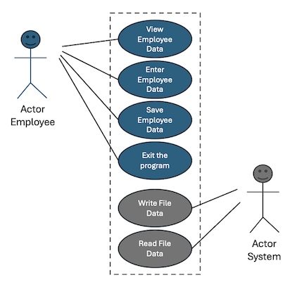
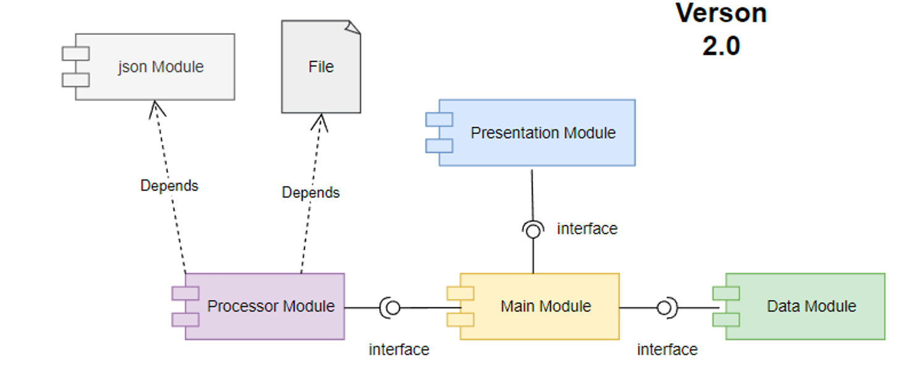

# Employee Rating Data Application

## Description
### What does it do?
The purpose of this application is to read and write employee rating data from a json formatted file, 
allow additional user entry and display the employee rating data to the user.

This application currently supports: 
- JSON formatted data files

The application takes user input from the actor (figure below), while the system reads and writes data to the 
file depending on user choices.



### Who is it for?

Intended for use by anyone needing to store employee name's (first and last), along with employee review data (date, rating).

## Installation

To run the program, the user must have python installed and have a json data file with employee data saved 
(i.e. not an empty file). If intending to use a file name other than `EmployeeRatings.json`, edit the 
`FILE_NAME` constant in the `data_classes.py` file.

## Usage
To ensure the application runs, ensure the data file, `EmployeeRatings.json`, contains data. If not, 
add some that can later be deleted.

Example of data entry in `EmployeeRatings.json`:

```commandline
[{
    "FirstName": "Bob",
    "LastName": "Smith",
    "ReviewDate": "2026-05-11",
    "ReviewRating": 4
  }]
```

To run the application, run the `main.py` script in your Integrated Development Environment (IDE) of choice or command-line. 
The application will present you with a menu of options (see below), from which you can choose what you'd like to do next. 
If you choose `2. Enter new employee rating data`, you can enter new data to the application in the correct format 
(see data classes module below). If the data entered is in the wrong format the application will present you with an 
error and will not save the data to the application's data object.

```
---- Employee Ratings ------------------------------
  Select from the following menu:
    1. Show current employee rating data.
    2. Enter new employee rating data.
    3. Save data to a file.
    4. Exit the program.
--------------------------------------------------
```

### Example uses

If you choose menu option `1. Show current employee rating data.`, the loaded data from the data file, and recently entered data will be displayed:
```
--------------------------------------------------
 Bob Smith is rated as 4 (Strong)
 Sue Jones is rated as 5 (Leading)
 Ripley Roo is rated as 5 (Leading)
 Peter Pettigrew is rated as 1 (Not Meeting Expectations)
--------------------------------------------------
```

If you choose menu option `2. Enter new employee rating data.`, the application will prompt input of new employee rating data, and once again display 
the employee data:

```
Enter your menu choice number: 2
What is the employee's first name? Vic
What is the employee's last name? Vu
What is their review date? 2026-03-02
What is their review rating? 4

--------------------------------------------------
 Bob Smith is rated as 4 (Strong)
 Sue Jones is rated as 5 (Leading)
 Ripley Roo is rated as 5 (Leading)
 Peter Pettigrew is rated as 1 (Not Meeting Expectations)
 Vic Vu is rated as 4 (Strong)
--------------------------------------------------

```

If you enter option `3. Save data to a file.`, the program will write data to the JSON data file and print the message
`Data was saved to the EmployeeRatings.json file.`.

Finally, if you enter option `4. Exit the program.` the program will exit.

### Components of the application

The application contains a main script (`main.py`), a set of modules for running the main script, 
and a set of unittests to ensure the application is behaving as intended.

Modules used by main script:
- `data_classes.py`
- `presentation_classes.py`
- `processing_classes.py`

Component diagram of dependencies for each module of the application, copied from Randall Root's class notes:


Unit test scripts included for testing and further development:
- `test_data_classes.py`
- `test_presentation_classes.py`
- `test_processing_classes.py`

#### Data Classes Module
_data_classes.py_

The Data Classes module defines all data constants and variables used by the program. Two data classes are defined, 
`Person` and `Employee`.

The `Person` class has two attributes:
- `first_name` (str): first name of the person.
- `last_name` (str): last name of the person

The `Employee` class has four attributes, two inherited from `Person` (`first_name`, `last_name`) and two new attributes:
- `review_date` (str): date of the review (Format: YYYY-MM-DD).
- `review_rating` (str): review rating from 1-5.

All attributes associated with `Employee` class will be prompted for user input when entering new Employee rating data (menu option 2).

#### Processing Class Module
_processing_classes.py_

The processing class module includes functions to read and write data to the file. Of the `FileProcessing` Class, 
there are two fucntions:

1) `read_employee_data_from_file`: reads data from JSON data file into the application.
2) `write_employee_data_from_file`: writes data from the application into JSON data file.

#### Presentation Class Module 
_presentation_classes.py_

The processing data class module, `IO` (e.g. Input/Output), contains functions for outputting error messages, 
menu options, and displaying employee rating data. The bulk of the application's functions can be found here, and include:

- `output_error_messages`: catches errors in entry or reading/writing files and outputs custom error messages.
- `output_menu`: output menu options to the user.
- `input_menu_choice`: stores user's menu choice.
- `output_employee_data`: provides current employee data.
- `input_employee_data`: captures user input of new employee data.

#### Main module
_main.py_

The main application module and the only one that should be run for the application. The main module loads the 
employee data from the JSON file, takes the user's menu choice and cycles through the processing functions based on that selection.

## Features
The application will do the following when run;
1) Load employee data from JSON formatted data file.
2) Display employee data to the user.
3) Take new employee rating data input.
4) Save all current and new input to the JSON data file.

## Further development
If changing or adding to functionality, use the unit test scripts to ensure the application still behaves as intended 
(files begin with `test_`). Each test is specific to the module include in it's name.

## Built With
Built in PyCharm using Python (v3.14).

## Credits
Developed as part of the University of Washington's Spring 2026 Introduction to Programming with Python Course.
 Application concept, scripts and programs developed largely using course materials from Randall Root.
